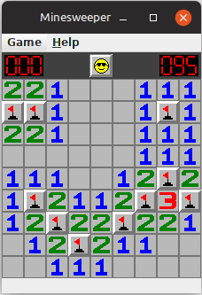
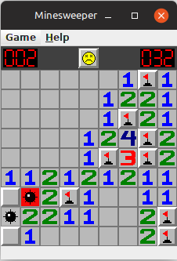

# Task:
Creating a version of the game `minesweeper`.

# How to play
1. `Left mouse click` - opens a cell.
2. `Right mouse click` - marks the cell as a mine.  
The goal is to discover all mines.  
Numbers represent the number of nearby mines.

__Note:__  
One functionality from the original game is not implemented, which is that first click always opens an empty cell.

